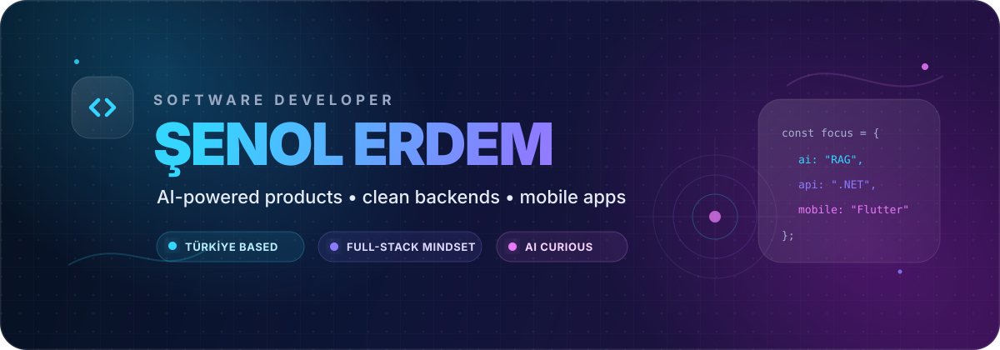

  

  
  
  

## About me

I am a software developer from Türkiye who enjoys turning ideas into useful, end-to-end products. My work spans **AI-powered applications**, **scalable backend systems**, **modern web interfaces**, and **cross-platform mobile experiences**.

- Building intelligent products with retrieval, semantic search, and modern language-model tooling
- Designing clean APIs and maintainable backend architectures with .NET and Python
- Creating interactive web and mobile experiences with React and Flutter
- Interested in product engineering, data-driven systems, and solving real-world problems

## Tech stack

| Backend & APIs | Frontend & Mobile | AI & Data | Infrastructure |
|:---:|:---:|:---:|:---:|
|  |  |  |  |

  
  
  
  
  
  
  

## Featured projects

<table>
  <tr>
    <td width="50%">
      <h3 align="center">Medical AI Chatbot</h3>
      

        
      

      
A medical-domain conversational system built with FastAPI, PostgreSQL, semantic retrieval, sentence transformers, FAISS, and ChromaDB.

      
<strong>Python · FastAPI · PostgreSQL · NLP · Vector Search</strong>

    </td>
    <td width="50%">
      <h3 align="center">Ankara Invest Map</h3>
      

        
      

      
An interactive investment-analysis platform combining regional data, maps, dashboards, and a modern full-stack architecture.

      
<strong>.NET 8 · React · TypeScript · Leaflet · ECharts</strong>

    </td>
  </tr>
  <tr>
    <td width="50%">
      <h3 align="center">Book API</h3>
      

        
      

      
A layered ASP.NET Core API featuring JWT authentication, role-based authorization, PostgreSQL, logging, and clean architecture patterns.

      
<strong>ASP.NET Core · EF Core · JWT · PostgreSQL</strong>

    </td>
    <td width="50%">
      <h3 align="center">YKS Quest</h3>
      

        
      

      
A gamified exam-preparation app with subject-based challenges, streaks, XP, ranks, timers, and answer explanations.

      
<strong>Flutter · Dart · Mobile UI · Gamification</strong>

    </td>
  </tr>
</table>

  
<strong>More projects worth exploring</strong>

   

  - [FarmingERP](https://github.com/senolerdemm/FarmingERP) — an ERP-oriented product for agricultural and livestock operations
  - [BarberAppointmentSystem](https://github.com/senolerdemm/BarberAppointmentSystem) — a complete appointment-management application
  - [Credit Card Fraud Detection](https://github.com/senolerdemm/Credit-Card-Fraud-Detection) — a machine-learning exploration of fraud detection
  - [Design Patterns](https://github.com/senolerdemm/DesignPatterns) — practical software design-pattern examples

## GitHub analytics

  
  

  

## Let's build something

I enjoy collaborating on practical products involving **AI**, **backend engineering**, **data-rich web applications**, and **mobile experiences**. Explore my repositories, open an issue, or reach out through GitHub.

  
  

 

  Designed and built with curiosity, clean code, and a little too much coffee.

<!-- profile-readme-refresh: 2026-06-19 -->
